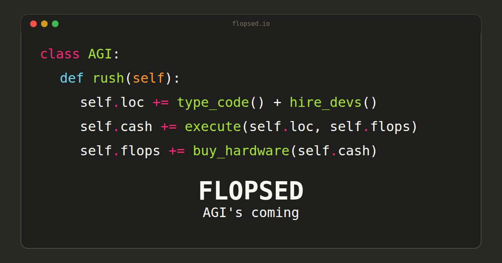

<div align="center">



# Flopsed

**Type code. Execute for cash. Race to AGI.**

An incremental idle game where you scale a tech company from a garage to the singularity.

[](https://flopsed.io)

[](https://www.typescriptlang.org/)
[](https://react.dev/)
[](LICENSE)
[](#internationalization)

</div>

---

## The Game

You start in a garage with nothing but a keyboard. Type code, execute it for cash, and figure out the rest. How far can you scale?

**~35 minutes** for a first playthrough. No spoilers here — go play it.

## Features

- **Typing mechanic** — real keystrokes feed the code pipeline
- **Deep tech tree** — unlock new mechanics as you progress
- **Dynamic events** — surprises that shake up your strategy
- **8 languages** — EN, FR, IT, DE, ES, PL, ZH, RU
- **8 editor themes** — Monokai, Dracula, Nord, Solarized, and more
- **Original soundtrack** — music that evolves as you grow

## Stack

| Layer | Tech |
|-------|------|
| UI | React 19 + Emotion |
| State | Zustand |
| Build | Rspack + SWC |
| Lint | Biome |
| Audio | Tone.js (music) + Web Audio API (SFX) |
| i18n | i18next + react-i18next |
| Monorepo | npm workspaces |

## Development

```bash
npm install
npm run dev          # Game dev server on :3000
npm run build        # Production build
npm run typecheck    # TypeScript strict check
npm run check        # Biome lint + format
npm run sim          # Balance simulation (3 player profiles)
npm run editor       # Data editor on :3738
```

## Project Structure

```
flopsed/
├── apps/
│   ├── game/           # Main game (React SPA)
│   ├── editor/         # Data editor (React + Express)
│   └── simulation/     # Balance simulation (CLI)
├── libs/
│   ├── domain/         # Game data + TypeScript types
│   ├── engine/         # Pure game math (no React)
│   └── design-system/  # Shared components + theme
└── specs/              # Game design doc
```

## Internationalization

The game is fully translated into 8 languages. Language is selectable in-game via flag picker in settings.

🇬🇧 English · 🇫🇷 Français · 🇮🇹 Italiano · 🇩🇪 Deutsch · 🇪🇸 Español · 🇵🇱 Polski · 🇨🇳 中文 · 🇷🇺 Русский

## Support

If you enjoyed the game, consider buying me a coffee:

[](https://buymeacoffee.com/parriauxmaxime)

## License

[MIT](LICENSE)
